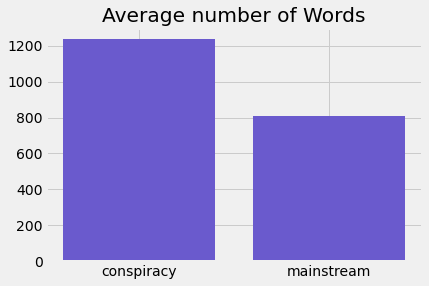
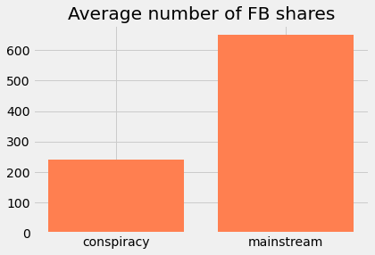

## Minimum Viable Product (MVP)

**Goal:** The goal of this project is to create a classification model that can predict whether or not an article is written with false information and tending towards spreading conspiracy theories. This model may be able to help flag articles for content moderation or assist with research about these conspiracy theories. This may also help discern the real from the fake, but that may be too hopeful for those who enjoy conspiracy theories.

**Process:** This data set is from the LOCO project (https://link.springer.com/article/10.3758/s13428-021-01698-z#Sec3), which is a corpus of around 90,000 articles, which are all topic matched with either "conspiracy" or "mainstream". So far in the process, this data has been cleaned and topic modeled using NMF.

**Preliminary conclusions:** I first attempted to classify using both Logistic Regression and a Random Forest, but I ended up getting similar results. The model was almost always picking "non-conspiracy" over "conspiracy", which I think is due to some class imbalance (there are around 15-20k conspiracy articles and 70-80k mainstream ones). I will probably start tuning my models and possibly tuning the topics output by NMF.

**From here:** I will work on different sampling techniques and model optimization in order to improve this model.

