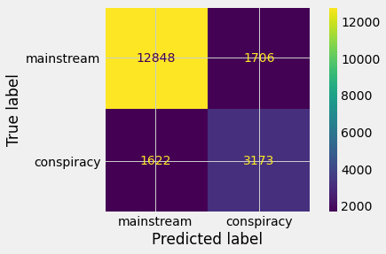

# LOCO_project

### Abstract

The goal of this project was to create a model that could identify whether an article is written with false information and spreading conspiracy theories based on language. The identifications could be used by researchers or platforms that want a tool to more effectively automate flagging articles that spread false information. I worked with data from a data set compiled by researchers called [LOCO](https://link.springer.com/article/10.3758/s13428-021-01698-z). The data set has around 90 million articles relating to different conspiracy theories with 70 million mainstream and 20 million conspiracy articles. I tested many different machine learning algorithms, and experimented with text cleaning and topic modeling in order to create a model that can help identify articles accurately.

### Design

This data set was built for researching the vocabulary and lexical features that conspiratorial articles tend to use. From this data set I engineered a dependent response variable based on whether the article was labeled a conspiracy or mainstream. I then used that as a response variable for machine learning models which used the articles and social media spread to identify. These models may be useful in identification of models using natural language processing, but as more conspiracies are created, the model will most likely need updated data to continue to preform.

### Data

The dataset contains 88 million articles, with about 20 million conspiracy and 70 million mainstream articles. This data contains the full text of the article, word length, number of paragraphs, various facebook sharing data, etc.

### Algorithms

**Feature Engineering**

- Topic modeling the text using NMF with 20 vectors
- VADER sentiment scoring
- Creating the response variable

**Model Evaluation and Selection**

Firstly I tested a logistic regression and a random forest classifier with no hyper parameter tuning, which both predicted almost all of the test data to be a mainstream article, because of how much class imbalance the dataset has. After running a Grid Search on both models, optimizing on ROC AUC, I found that the Random Forest Classifier had the better result. I chose ROC AUC to optimize on because I want my model to have a very high recall, but not at the total cost of the recall and F1. The ROC AUC metric shows how well the model is able to distinguish between the classes and does a good job of optimizing the metrics. The final model does an okay job of distinguishing between the classes, it doubles the class weight of the conspiracy group, and selects from the probabilities over 40% threshold instead of 50%, the final metrics are below.

Final Test Metrics:

- Accuracy: 0.828
- Precision: 0.650
- Recall: 0.661
- F1: 0.655

### Tools

- Pandas and Numpy for data handling and feature engineering
- NLTK and re for text preprocessing
- Sklearn for modeling
- Matplotlib and sklearn for plotting

### Communications

Please find the presentation and code in the github.

### Citation:

Miani, A., Hills, T. & Bangerter, A. LOCO: The 88-million-word language of conspiracy corpus. Behav Res 54, 1794–1817 (2022). https://doi.org/10.3758/s13428-021-01698-z
